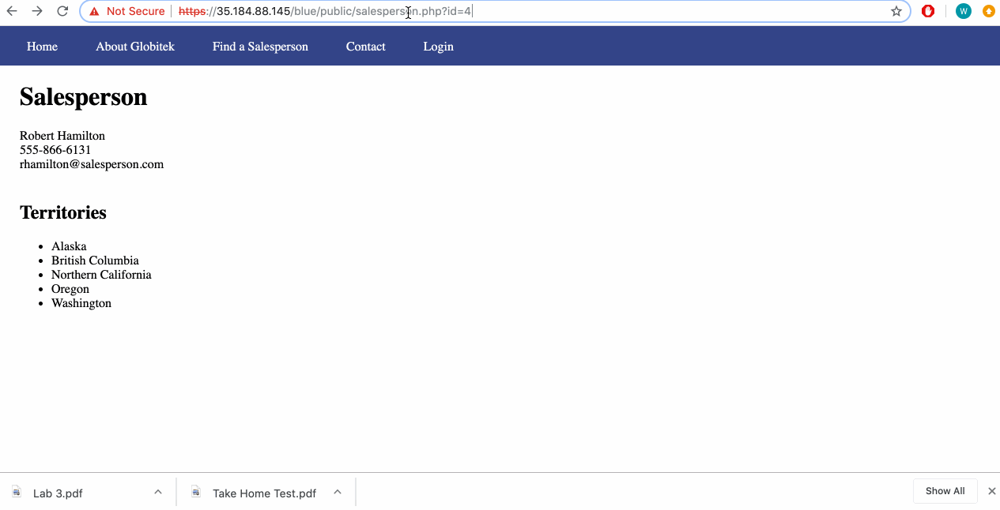
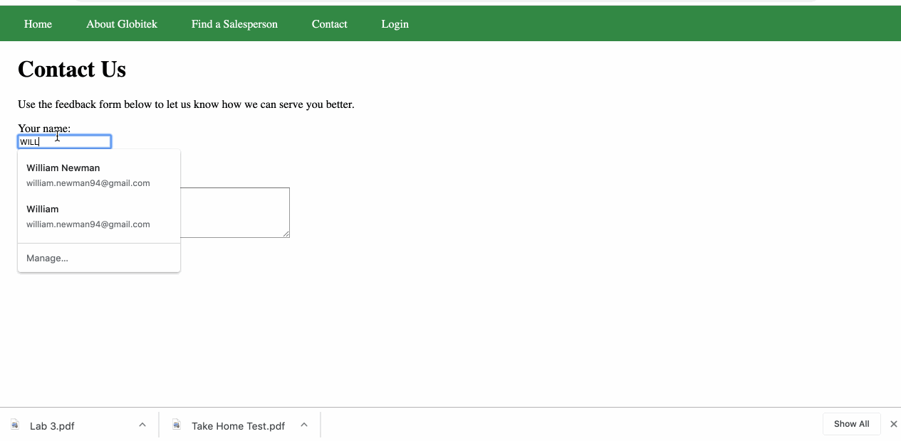
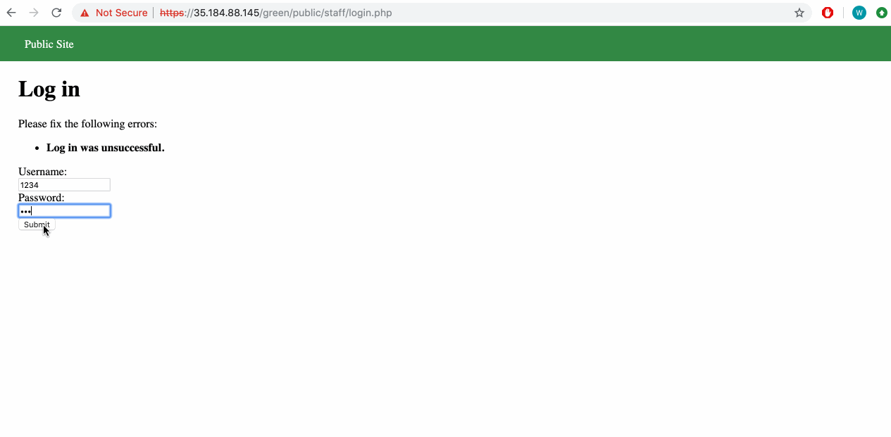
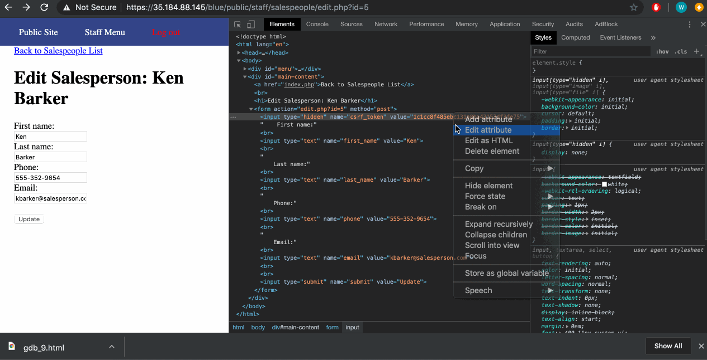
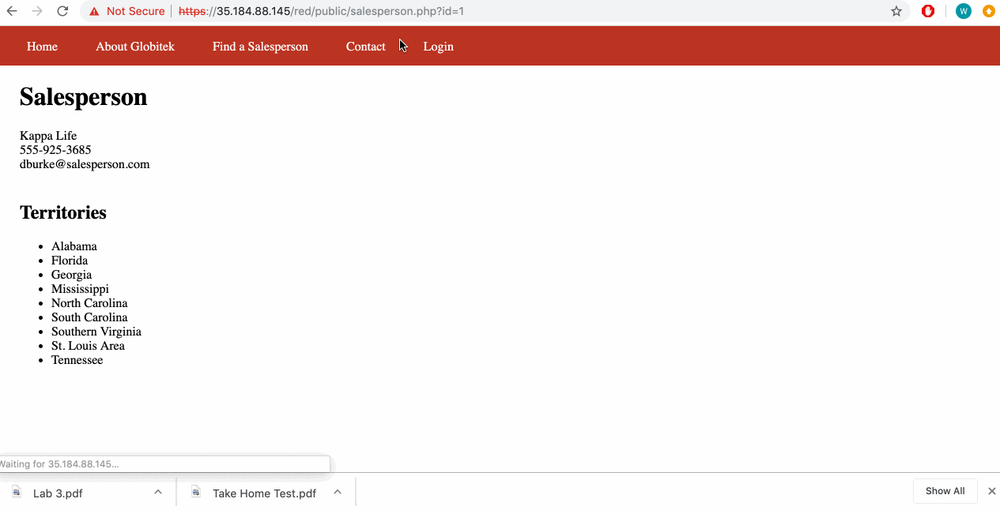

# Project 8 - Pentesting Live Targets

Time spent: **5** hours spent in total

> Objective: Identify vulnerabilities in three different versions of the Globitek website: blue, green, and red.

The six possible exploits are:
* Username Enumeration
* Insecure Direct Object Reference (IDOR)
* SQL Injection (SQLi)
* Cross-Site Scripting (XSS)
* Cross-Site Request Forgery (CSRF)
* Session Hijacking/Fixation

Each version of the site has been given two of the six vulnerabilities. (In other words, all six of the exploits should be assignable to one of the sites.)

## Blue

Vulnerability #1: SQL Injection

    1. Navigate to salespeople page and type "' OR 1=1--'

Vulnerability #2: Session Hijacking

    1. Navigate to the change_session_id.php and get a valid session id
    2. Add that session id on an empty session using change_session_id.php

## Green

Vulnerability #1: XSS

    1. Submit a form that has a script tag with some javascript.
    2. Wait for an admin to go the page.

Vulnerability #2: User Enumeration

    1. When you enter a known username, the response is emboldened

## Red

Vulnerability #1: CRSF

    1. Notice that when u change the token in the blue or green sites, you no longer can submit any edit forms.
    2. However when you change a token on a red site you're still able to submit the form which indicates a CRSF.

Vulnerability #2: IDOR

    1. Navigate to the salesperson page.
    2. See that you can access unmentioned salespeople when you change the id in the url.

## Notes

Finding the CRSF vulnerability was a bit difficult however this assignment was easier than last weeks. 
